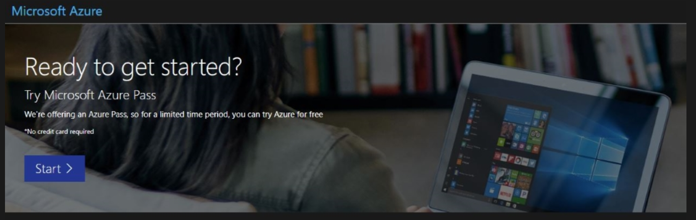
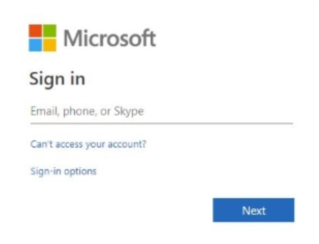
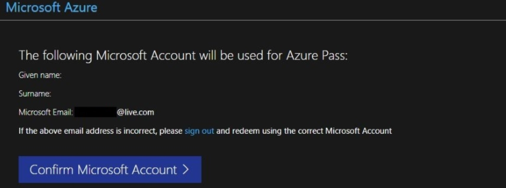
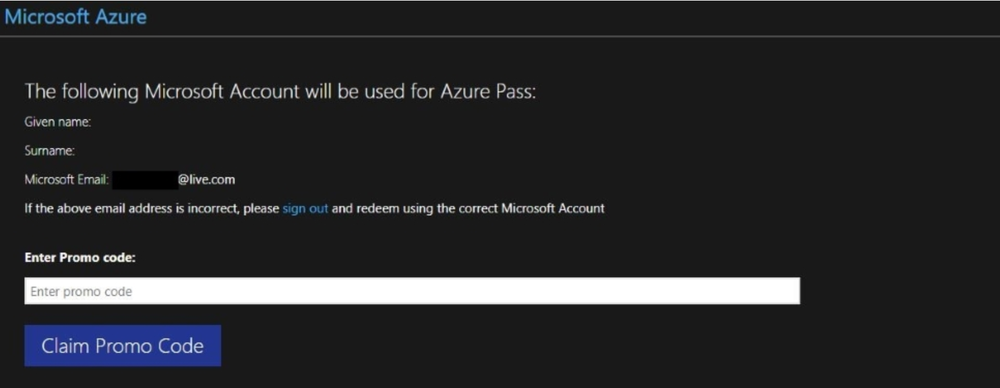
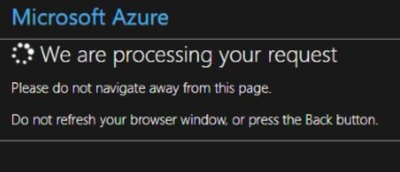
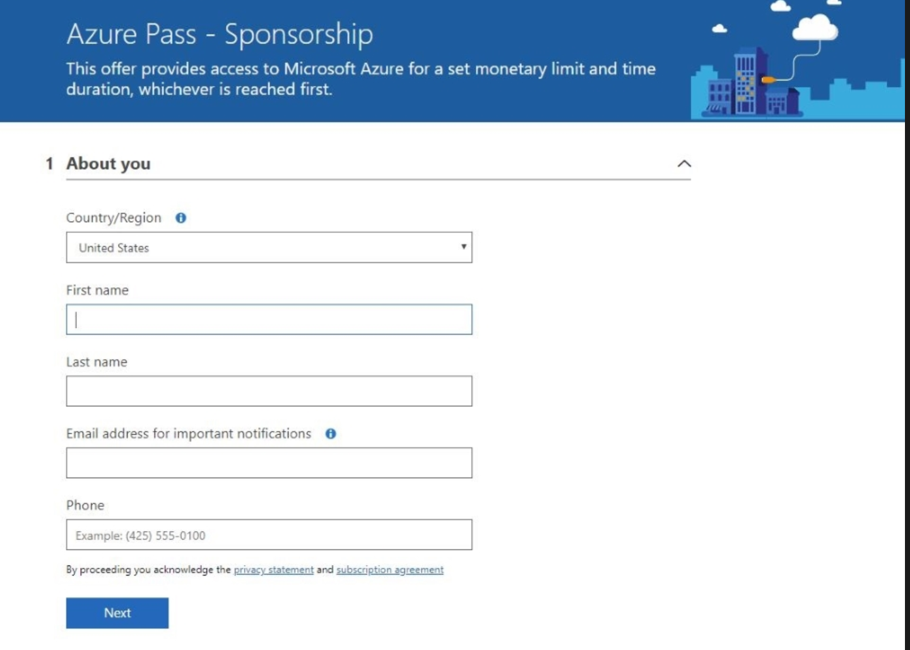
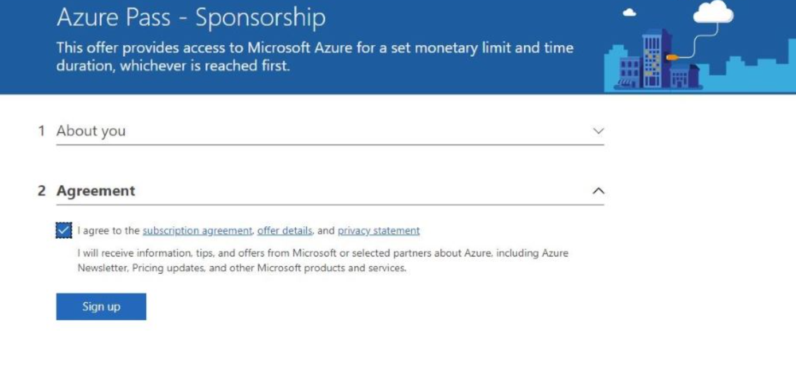
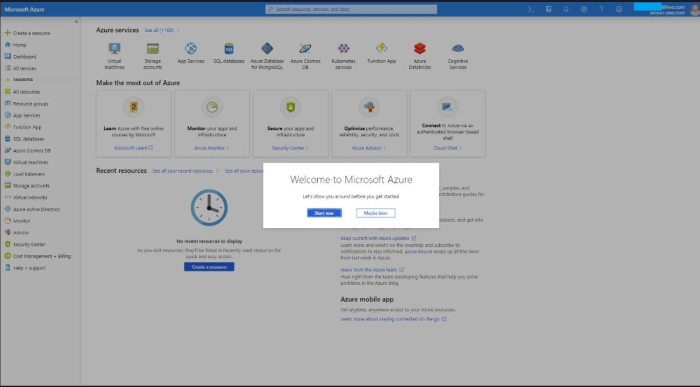

# Set up Azure Pass Lab

Exercise 1: Creating a Microsoft Azure Pass Subscription

This exercise shows how to create an Azure Pass subscription.

#### Tasks

1.  Retrieve Azure Pass from Lab on Demand Resources tab

    1.  Log in to [https://mslearningcampus.com](https://www.mslearningcampus.com) with **Microsoft Account**

        1.  Scroll down and launch the lab – wait for lab to come up

        2.  go to Resources on right side to get Azure Pass Code

        3.  Copy code and go on to next step

2.  Redeem a Microsoft Azure Pass Promo Code.

    1.  Open a browser and navigate to: [www.microsoftazurepass.com](http://www.microsoftazurepass.com)

    2.  It is recommended you close all browsers and open a new **In-Private** Browser session. Other log-ins can persist and cause errors during the activation step.

    3.  Click the **start** button to **get started**.

        

    4.  Enter your account login information and select “**Sign In**”.

> 

5.  Click “**Confirm**” if the correct email address is listed.

> 

6.  Enter your promo code in the Promo code box and click “**Claim Promo Code**”.

> 

7.  It may take up to 5 minutes to process the redemption.

> 

3.  Activate your subscription.

    1.  When the redemption process is completed, it will redirect to the **sign up** page. Enter your account information and click “**Next**”.

        

    2.  Click the agreement check box and click the **Sign up** button. It may take a few minutes to process the request.

        

    3.  Your Azure subscription is ready.

> 

Exercise has been completed.
