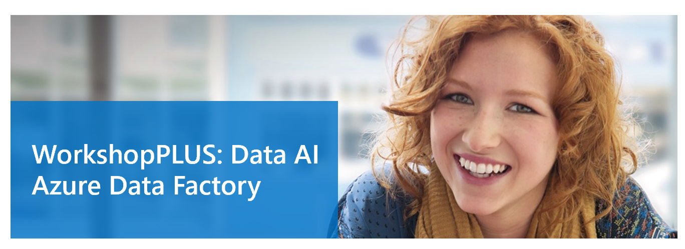

# Create and monitor Azure Data Factory using ARM

**Introduction**

During this lab, you will learn how to use an ARM template to create the resources needed to complete this and future labs. You will also create and configure the services as needed to prepare for future labs.

**Estimated Time**

30 minutes

**Objectives**

At the end of this lab, you will be able to:

-   Create an Azure Data Factory

**Logon Information**

Use the following credentials to sign into the virtual environment.

-   Username: **Administrator**

-   Password: **Microsoft1**

# Table of Contents

[Lab: Create and Monitor Azure Data Factory using ARM 3](#lab-create-and-monitor-azure-data-factory-using-arm)

[Exercise 1: Provision Lab Resources using an Azure Resource Manager (ARM) Template 3](#exercise-1-provision-lab-resources-using-an-azure-resource-manager-arm-template)

[Exercise 2: Create the input folder and files in container 8](#exercise-2-create-the-input-folder-and-files-in-container)

## Lab: Create and Monitor Azure Data Factory using ARM

### 

### Exercise 1: Provision Lab Resources using an Azure Resource Manager (ARM) Template

Throughout this workshop’s labs, you will utilize various Azure resources outside of Data Factory. To maximize your learning about Data Factory, you will provision all necessary Azure resources in one step by leveraging ARM templates.[1]

#### Tasks

1.  Connect to the Microsoft Azure Portal.

<!-- -->

1.  Open Edge browser and navigate to <http://portal.azure.com/> to connect to Microsoft Azure Portal.

2.  Sign in with your credentials.

<!-- -->

2.  Deploy resources from an ARM template.

<!-- -->

1.  To deploy a customized template through the portal, select **Create a resource****.

    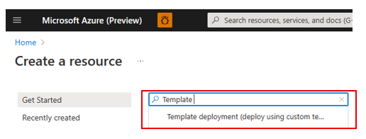

3.  Select **Create.**

    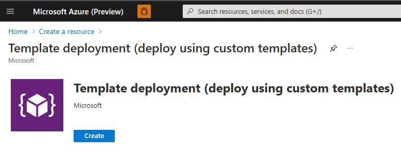

4.  Select **Build your own template in the editor**.

    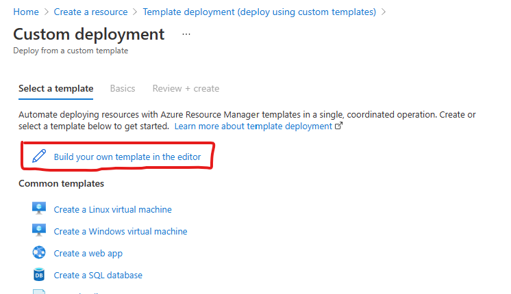

5.  Click **Load file** and select file **\\LabFiles\\M01\_L02\_Lab01\\ADF\_Workshop\_ARM\_Template.json** into the editor. Review the file to see the details of the items being created.

    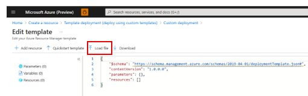

6.  Click **Save** in the bottom left of the blade.

7.  The Resource Template will display a page for you to enter values into for the parameters.

    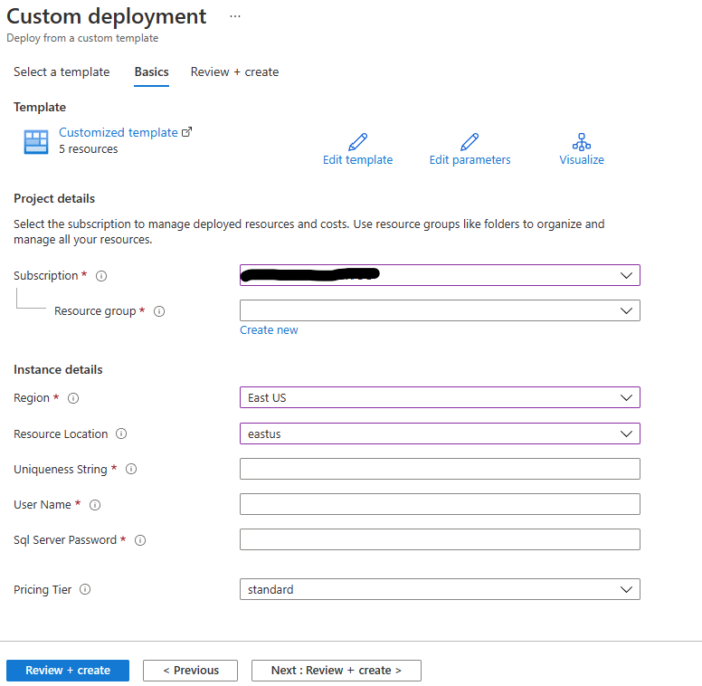

8.  Your subscription details should populate.

9.  For Resource group, select **Create new** and enter a name for the new resource group (Ex: RG-ADFdemo).

10. For Region, select *East US*, in which the resource group will be located.

11. For Resource Location, select *eastus*, in which all resources will be created.

12. Enter a Uniqueness String, which will be used as a prefix for resource names to help you identify them. Some of the resources require a name that is unique across all of Azure.

    1.  Do not make the Uniqueness string too long because some resource names have a character limit.

    2.  Do not use uppercase letters or special characters because some resource names do not allow them.

13. Enter a User Name, this will be used as the name for the admin users on the SQL Server being created.

14. For SQL Server Password,

    1.  Make sure it uses a combination of three of the four **uppercase**, **lowercase**, **numbers** and **special** **characters**.

    2.  Make sure it is at least **12** **characters** **long** and cannot be the same as the uniquenessString or the userName.

        ![](Media/image0016.png" style="width:3.07335in;height:2.38575in" />

15. For Pricing Tier, leave this set to **standard**. This reflects the pricing tier for the Azure Databricks workspace being created.

16. Click **Review + create**

17. Click **Create**.

<!-- -->

3.  Verify Resources.

<!-- -->

1.  Wait for the notification that all resources have been deployed.

2.  Select **Resource groups** in the left pane then go to your newly created resource group.

3.  Verify that the following resources were created:

-   Data Factory

-   Storage Account

-   Databricks Service

-   SQL Database

-   SQL Server

    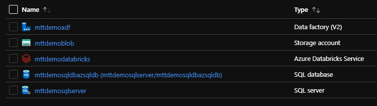

    1.  If you do not see all of the resources above, it could be because your Uniqueness string was not unique enough, was too long, or included upper case or special characters. If the SQL database was not created, ensure that your password meets the rules as defined in step 2.o above.

4.  Add the Client IP address to the SQL Server

<!-- -->

1.  Within your newly created resource group, click on the newly created SQL Server.

    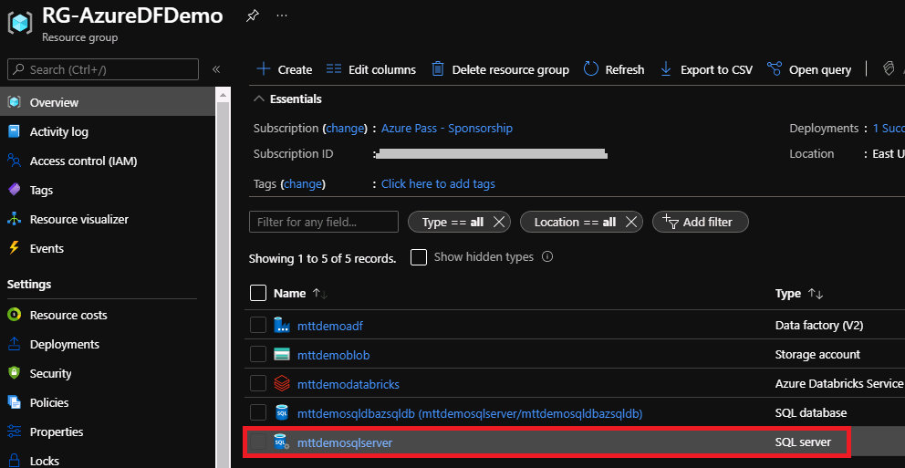

2.  In the left pane, under Security, Click on Networking.

    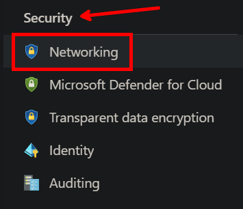

3.  Under Firewall rules section, Select the **+Add client IP** option and set **Allow access to Azure services** to **ON**.

    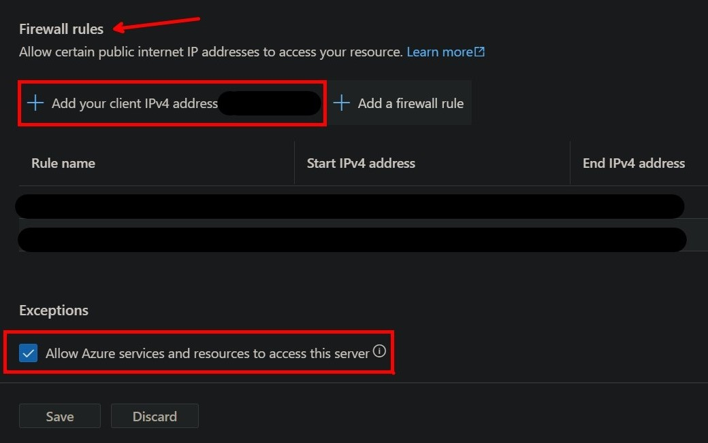

4.  Then click **Save**.

Exercise 1 has been completed.

### Exercise 2: Create the input folder and files in container

In this exercise, you will select the blob storage account created via the ARM template. You create a container called **adftutorial** and a folder named **input** in the container, and then upload a sample file to that input folder.

#### Tasks

1.  Select Storage account

    Select your Storage account from the Azure portal. You can use the search bar at the top and it will end in **blob** or find it in your new Resource Group. Select your storage account, then select **Containers**.

    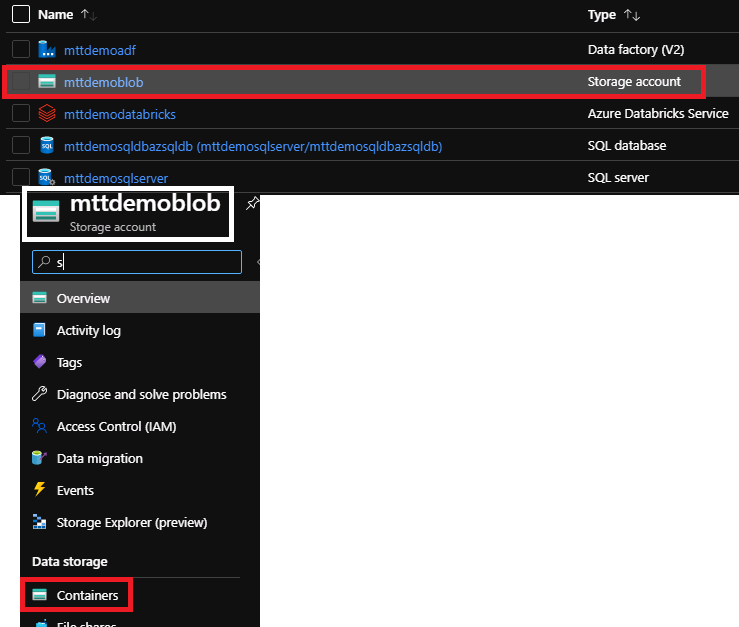

2.  Create a container

<!-- -->

1.  On Containers page, select **+Container** from the toolbar.

    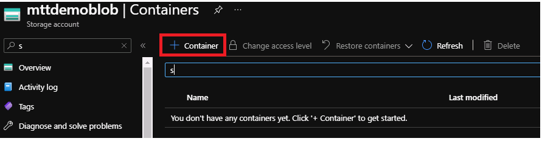

<!-- -->

1.  In the New container dialog box, enter **adftutorial** for the name, and click the **Create** button.

    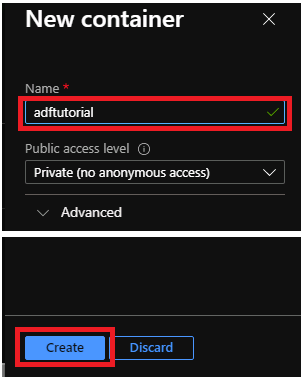

2.  Once created, click on the container name, **adftutorial**.

<!-- -->

5.  Upload a file

<!-- -->

1.  On the Container page, select **Upload** from the toolbar.

    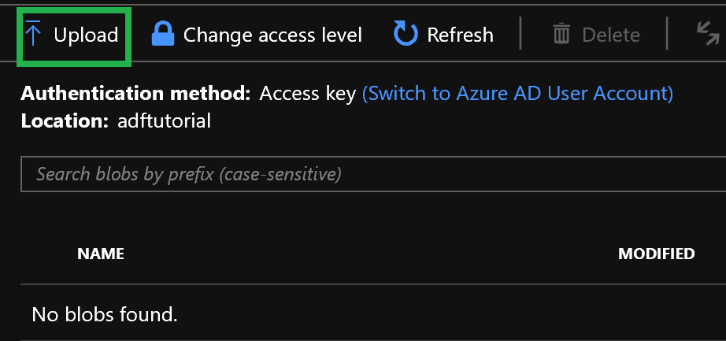

<!-- -->

3.  On the Upload blob page, select **Advanced**.

    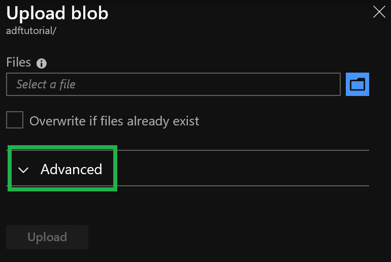

4.  In the Azure portal, on the Upload blob page, click on the **folder** icon next to the **Select a file** box and select the file **\\LabFiles\\M01\_L02\_Lab01\\emp.txt** file.

5.  In the **Upload to folder** box, enter **input**.

    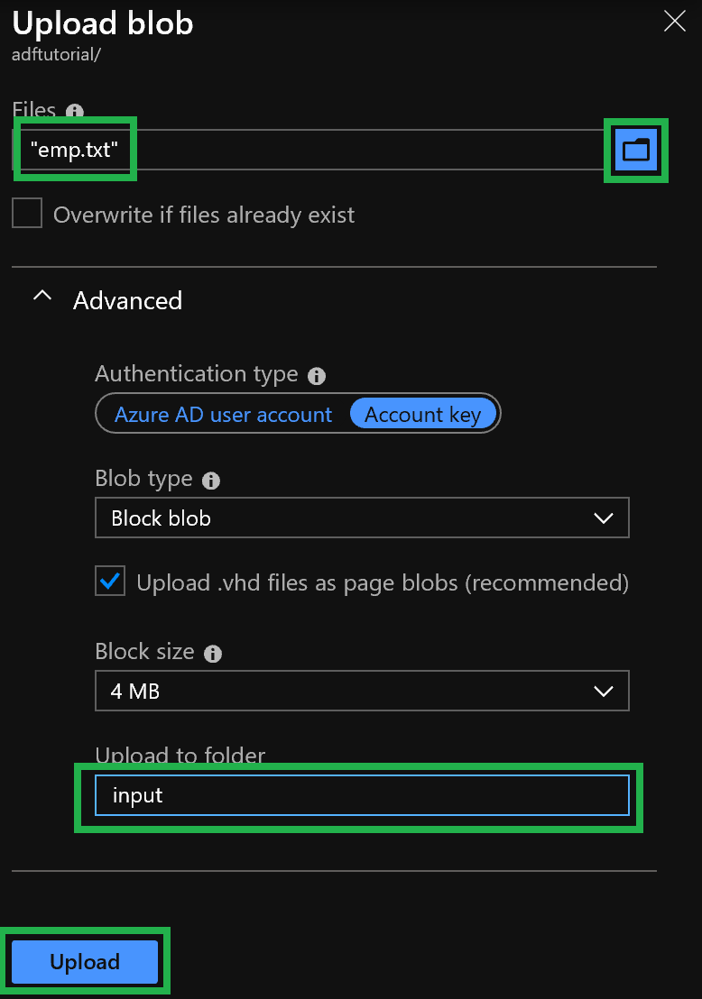

6.  Click the **Upload** button.

    You should see the emp.txt file and the status of the upload in the list.

    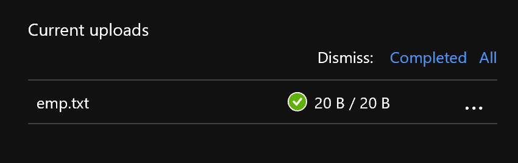

7.  Close the Upload blob page by clicking **X** in the corner.

    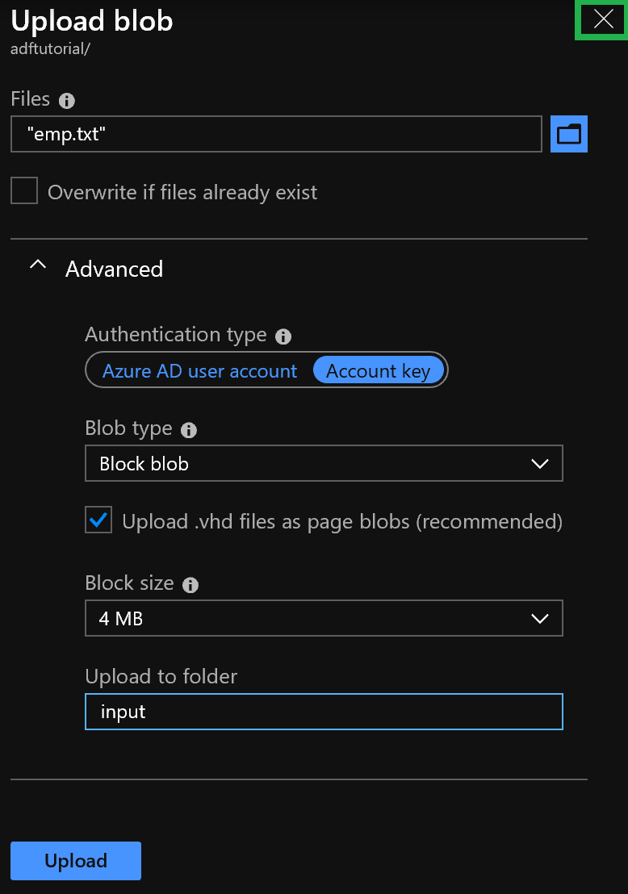

Exercise 2 has been completed.

[1] *An [ARM Template](https://docs.microsoft.com/en-us/azure/azure-resource-manager/resource-group-overview) is a JSON file that defines one or more resources to deploy to a resource group or subscription. The template can be used to deploy the resources consistently and repeatedly.*
