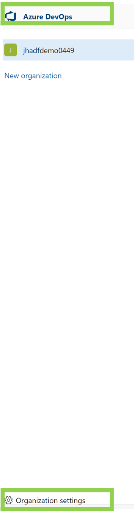
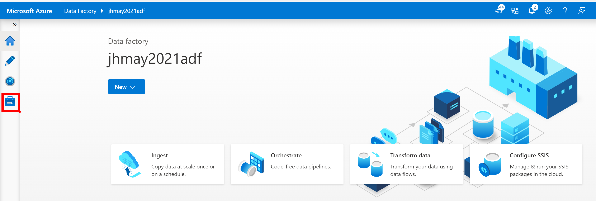

# Configure Data Factory Git Integration

**Introduction**

During this lab, you will learn how to set Git Integration for Azure Data Factory.

**Estimated Time**

30 minutes

**Objectives**

At the end of this lab, you will be able to:

-   Create an Azure DevOps Git Repository

-   Set branches on your Repository

-   Switch between Live and Git mode

**Logon Information**

Use the following credentials to sign into the virtual environment.

-   Username: **Administrator**

-   Password: **Microsoft1**

# Table of Contents

[Lab: Configure Data Factory Git Integration 3](#lab-configure-data-factory-git-integration)

[Exercise 1: Set up Azure DevOps Account 3](#exercise-1-set-up-azure-devops-account)

[Exercise 2: Setting up Azure Data Factory Source Control 10](#exercise-2-setting-up-azure-data-factory-source-control)

## Lab: Configure Data Factory Git Integration

### 

### Exercise 1: Set up Azure DevOps Account

#### Tasks

1.  **Configure a DevOps Account for the same Microsoft Account you are using for the Azure Free Pass Subscription**

<!-- -->

1.  Go to <https://dev.azure.com/> and sign in with your Microsoft Account

2.  Click Start Free and log in

    

    

3.  When prompted for Organization Name and Region, enter a name and choose a region

    

4.  Create a Project (Keep default of Private) ![](Media/image0034.png" style="width:4.03125in;height:3.22292in" alt="Graphical user interface, application Description automatically generated" />

5.  Within your Project, click on **Repos**

    

6.  Then click on Files and **Initialize**

    

7.  Click on **Azure DevOps** on the top left of the page

    

8.  Click on your Organization Name, if it is not selected, then choose **Organization** **Settings at the bottom of the page**

    

9.  Click on **Azure Active Directory**

10. Click **Connect Directory**

    

11. Chose **Default Directory** and click **Connect**

    

12. Click **Sign Out** to sign out of Azure Devops. This is necessary for connecting to AAD**.** It will take several minutes for the sign you off so please be patient – do not close the window manually. If you have multiple Microsoft Accounts, it further prompt to choose which account to sign out of.

    

    

13. **Congratulations**! You have now configured your Free Azure Subscription to work with an Azure DevOps account for source control. After you have created your Free Subscription, you can now work directly within your workstation environment rather than through the Labs on Demand Environment (if your organization rules allow it)

14. \*\* You may need to open a **private** or **incognito** browser window when signing into Azure or Data Factory

    1.  When configuring your Data Factory for Git, it may take some time for the Azure Active Directory to update; If you do not see your DevOps Account or Project, ensure your DevOps Organization is configured with AAD

Exercise 1 has been completed.

### Exercise 2: Setting up Azure Data Factory Source Control

Source Control allows developers to check-in/push Azure Data Factory code and assets to a code repository. Azure DevOps source control tracks the history of who made changes and what the changes were, as well as provides a centralized source for all your code. Source control also allows for easy cross-teams collaboration..

*<u>Note</u>: It is **<u>not</u>** recommended to switch in between live mode and Git mode as the changes made into live mode may not be seen in Git mode.*

#### Tasks

1.  Login to Azure Portal, navigate to your Azure Data Factory Account and then click on Open

    

2.  Select the Manage icon in the left panel

    

3.  Select the Git configuration under Source Control heading then click Configure in the middle of the page.

    

4.  In the Repository settings pane to choose the repository type. Select Azure DevOps Git and your subscription then select Continue.

    

5.  This opens additional Git repository settings based on your repository type selection.

    Specify your Azure DevOps organization name, Project Name, and Repository Name. Select ‘main’ for both the Collaboration branch and Import resource into this branch. Click Apply

    

6.  The Set working branch is asking you which branch you want to save your code to. Since you are the only person working on this Data Factory, just leave the default, Use existing and main. Click Save.

    1.  If you were working with multiple developers on this Data Factory, you would want to create separate branches to save your code to. This will be discussed in a later training module.

        

7.  Review your Git repository settings. Note that you are now working within the main branch rather than the directly within the Data Factory service.

    1.  Notice you also have a Save all button (currently not enabled because no changes have been made within the Data Factory UI). When you make a change to your Data Factory this will be enabled.

        

Exercise 2 has been completed.
