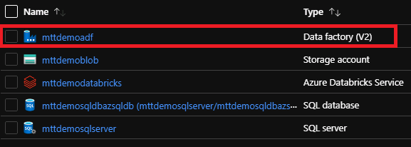
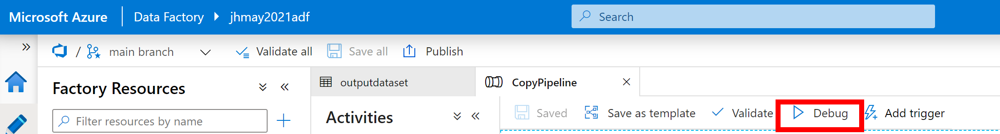

# Create and Monitor a Data Factory Pipeline  

on Azure Portal**

**Introduction**

During this lab, you will learn how to navigate the Azure Data Factory *Author and Monitor* interfaces to create and monitor a Data Factory. In this Data Factory we will create a pipeline that copies data from one folder to another folder in Azure Blob Storage.

**Estimated Time**

30 minutes

**Objectives**

At the end of this lab, you will be able to:

-   Create a linked service

-   Create datasets

-   Create, debug, trigger, and monitor a Pipeline.

**Login Information**

Use the following credentials to sign into the virtual environment:

-   Username: **Administrator**

-   Password: **Microsoft1**

# Table of Contents

[Exercise 1: Create a linked service 3](#exercise-1-create-a-linked-service)

[Exercise 2: Create datasets 6](#exercise-2-create-datasets)

[Exercise 3: Create a Pipeline 11](#exercise-3-create-a-pipeline)

[Exercise 4: Debug and Trigger the Pipeline Manually 12](#exercise-4-debug-and-trigger-the-pipeline-manually)

[Exercise 5: Monitor the Pipeline 15](#exercise-5-monitor-the-pipeline)

#### Lab: Create and Monitor a Data Factory on Azure Portal

During this lab, you will learn how to use the Azure Data Factory *Author & Monitor* interfaces to create and monitor a data factory pipeline.

### Exercise 1: Create a linked service

In this exercise, you create a linked service to link your Azure storage account to the data factory. The linked service has the connection information that the Data Factory service uses at runtime to connect to it.

#### Tasks

1.  Select Open Azure Data Factory Studio

    Select your Azure Data Factory service from the Azure portal. You can use the search bar at the top and it will end in **adf** or select from your Resource Group.

    

    Select the **Open Azure Data Factory Studio** tile to start the Azure Data Factory user interface (UI) application on a separate tab.

<!-- -->

1.  Switch to Manage tab

    On the Let's get started page, switch to the **Manage** tab in the left panel.

    

2.  Create a Linked Service

<!-- -->

1.  Select **Linked services**, and then select the **+New** button.

    

    On the New Linked Service page, select **Azure Blob Storage**, and then select **Continue**.

    

<!-- -->

1.  Complete the following steps:

    1.  For Name, enter **AzureStorageLinkedService**.

    2.  For Authentication Method, ensure **Account Key** is selected.

    3.  For Account selection method, ensure **From Azure subscription** is selected.

    4.  Select your **Azure subscription**.

    5.  Select **storage account name** from the drop downs.

    6.  Select **Test connection** to confirm that the Data Factory service can connect to the storage account.

    7.  Select **Create** to save the linked service.

        

    <!-- -->

    1.  Linked service has been created.

        

Exercise 1 has been completed.

### 

### Exercise 2: Create datasets

In this exercise, you create two datasets: InputDataset and OutputDataset. These datasets are of type AzureBlob. They refer to the Azure Storage linked service that you created in the previous exercise.

The input dataset represents the source data in the input folder. In the input dataset definition, you specify the blob container (adftutorial), the folder (input), and the file (emp.txt) that contain the source data.

The output dataset represents the data that's copied to the destination. In the output dataset definition, you specify the blob container (adftutorial), the folder (output), and the file to which the data is copied. Each run of a pipeline has a unique ID associated with it. You can access this ID by using the system variable RunId. The name of the output file is dynamically evaluated based on the run ID of the pipeline.

In the linked service settings, you specified the Azure storage account that contains the source data. In the source dataset settings, you specify exactly where the source data resides (blob container, folder, and file). In the sink dataset settings, you specify where the data is copied to (blob container, folder, and file).

#### Tasks

1.  Click on the Pencil/Author button in the left pane.

    

2.  Create Datasets

<!-- -->

1.  Select the **+** (plus) button and then select **Dataset**

    

2.  On the New Dataset page, select **Azure Blob Storage**, and then select **Continue**.

    

3.  Since we are using a comma separated file, select **DelimitedText** and click the **Continue** button.

    

4.  Give the data set a name, such as InputDataset and select the Azure Storage linked service you created in the previous exercise.

5.  Select the folder button to the right of the File path.

    

6.  Then to navigate to the input file (adftutorial/input/emp.txt) and click the OK button.

    

7.  Repeat the steps to create the output dataset:

<!-- -->

1.  Select the + (plus) button, and then select Dataset.

    

2.  On the New Dataset page, select Azure Blob Storage, and click the Continue button.

3.  Select DelimitedText and click the Continue button.

4.  Specify OutputDataset for the name and select the Azure Linked Service created in the previous exercise.

5.  Enter adftutorial as the file path container and output for directory.

6.  Select None for Import Schema then select OK.

    

7.  Click ok.

    Choose **Save all** from the menu bar to save your changes to your DevOps repo. If you do not see Save all, make sure you have a DevOps branch selected rather than Data Factory.

    

8.  Select Publish All then Publish on the next screen.

    

Exercise 2 has been completed.

### 

### Exercise 3: Create a Pipeline

In this exercise, you create and validate a pipeline with a Copy activity that uses the input and output datasets created in a previous exercise. The copy activity copies data from the file you specified in the input dataset settings to the file you specified in the output dataset settings. If the input dataset specifies only a folder (not the file name), the copy activity copies all the files in the source folder to the destination.

#### Tasks

1.  Create your pipeline.

<!-- -->

1.  Select the **+** (plus) button under Factory Resources, and then select **Pipeline**.

    

<!-- -->

1.  In the Properties pane to the right, specify **CopyPipeline** for Name.

2.  In the Activities toolbox, expand **Move & Transform**. Drag the **Copy** **Data** activity from the Activities toolbox to the pipeline designer surface. You can also search for activities in the Activities toolbox. Specify **CopyFromBlobToBlob** for Name.

3.  Navigate to the Source tab in the Copy Data activity settings and select **inputdataset** for Source Dataset.

4.  Navigate to the Sink tab in the Copy Data activity settings and select **outputdataset** for Sink Dataset.

5.  Choose **Save all** from the menu bar to save your changes to your DevOps repo. If you do not see Save all, make sure you have a DevOps branch selected rather than Data Factory.

    

Exercise 3 has been completed.

### Exercise 4: Debug and Trigger the Pipeline Manually

In this exercise, you will debug the pipeline before deploying entities (linked services, datasets, pipelines) to Azure Data Factory. Then, you manually trigger a pipeline run.

#### Tasks

1.  Debug the Azure Data Factory Pipeline.

<!-- -->

1.  On the pipeline toolbar above the canvas, select **Debug** to trigger a test run.

    

<!-- -->

6.  Confirm that you see the status of the pipeline run on the **Output** tab of the pipeline settings at the bottom.

    

7.  *In a different web browser tab,* go to your Azure Portal, navigate back to the Azure Storage account containing the **adftutorial** container.

8.  From the Data storage section in the left pane, select **Containers**.

    

9.  Select the **adftutorial** container.

10. Confirm that you see the output file, emp.txt, in the output folder.

    

<!-- -->

1.  Run/Trigger pipeline.

<!-- -->

1.  Go back to the Data Factory portal with your Data Factory selected.

2.  Before you trigger a pipeline, you must publish entities to Data Factory. To publish, select **Publish** at the top of the portal.

<!-- -->

11. To trigger the pipeline manually, select **Add** **Trigger** on the pipeline toolbar, and then select **Trigger Now.**

12. Select **OK** in the Pipeline run flyout.

Exercise 4 has been completed.

### Exercise 5: Monitor the Pipeline

#### Tasks

1.  Monitor your pipeline.

<!-- -->

1.  Switch to the **Monitor** tab on the left.  
    

<!-- -->

13. Under **Pipeline runs,** under **Pipeline name**, select the **CopyPipeline** hyperlink. Here you can see the status of the copy activity run on this page.

    

14. To view details about the copy operation, select the **Details** (eyeglasses image) link in the Actions column. For details about the properties, see [Copy Activity overview](https://docs.microsoft.com/en-us/azure/data-factory/copy-activity-overview).  
    

Exercise 5 has been completed.
