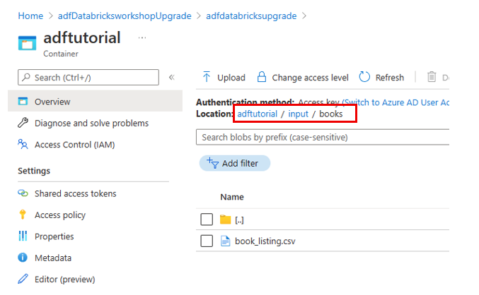

# Copy Data Wizard

**Introduction**

This lab walks through the Copy Data Wizard.

In this lab we will:

> Show the graphical user interface for Copying Data

**Estimated Time**

20 minutes

**Objectives**

At the end of this lab, you will be able to:

> Use the copy data wizard

# Table of Contents

[Lab: Azure Data Factory Copy Data Wizard 3](#lab-azure-data-factory-copy-data-wizard)

[Exercise 1: Upload Sample Data 3](#exercise-1-upload-sample-data)

[Exercise 2: Copy Data via the Wizard 3](#exercise-2-copy-data-via-the-wizard)

## Lab: Azure Data Factory Copy Data Wizard

During this lab, you will learn how to copy data with the Copy Data wizard.

### Exercise 1: Upload Sample Data

Throughout this workshop’s labs, you will be utilizing various Azure resources outside of Data Factory.

#### Tasks

1.  Create a container

<!-- -->

1.  From the Resource Group you created in M01\_L01\_Lab01, select the **Storage Account** created in the lab.

2.  On the Storage account page, select **Containers** under the **Data storage** section.

3.  Select the container **adftutorial**.

<!-- -->

2.  Upload sample .txt file to Container.

<!-- -->

1.  On the Container page, select **Upload** on the toolbar.

<!-- -->

4.  On the Files selection box, click on the **folder icon** to upload a file. Navigate to the **/LabFiles/M02\_L01\_Lab02** folder and select the file **book\_listing.csv** and **Open** it.

5.  Select **Advanced** to show additional options.

6.  Under the **Upload to folder box** type **input/books**.

7.  Click **Upload.**

    

8.  Confirm that the folder is input, and the file is **book\_listing.csv**, and **Upload**. You should see the book\_listing.csv file and the status of the upload in the list.

    

Exercise 1 has been completed.

### Exercise 2: Copy Data via the Wizard

#### Tasks

1.  **Launch your Azure Data Factory in a separate browser tab.**

    In the Azure portal, navigate to the ADF instance you previously provisioned, and then launch the Azure Data Factory UI by selecting Open in the ADF Overview blade.

    

2.  **On the ADF UI landing page, select Ingest.**

> 

3.  On the Properties Page of the Copy Data wizard

<!-- -->

1.  Set the configurations as such:

    Task Type: Choose Built-in copy task:

    Task cadence or Task schedule: Choose Run once now.

2.  Select Next. 

<!-- -->

4.  Configure the Source to point to the Azure Blob Storage Linked Service.

    1.  On the Source dataset page, select source type Azure Blob Storage and select the AzureStorageLinkedService created in last lab

    2.  Click the Folder button next to the word **Browse** to drill down to the input file **adftutorial/input/books/book\_listing.csv** and select **Choose.**

    3.  Then click **Next**.

        

5.  **Validate the File Format settings**

<!-- -->

9.  Inspect the file. Notice it has the column names in the first row.

10. Select **Next** to finish the Source.

    

<!-- -->

6.  Configure the Destination to point to the Azure Blob Storage Linked Service.

    1.  On the Target dataset page, select source type Azure Blob Storage and select the AzureStorageLinkedService created in last lab

    2.  In the Folder path type in adftutorial/output/booklist

    3.  Enter the filename of book\_listing.csv

    4.  Ensure Copy behavior specifies None and Max Concurrent connections is blank

    5.  Click next

        

7.  Validate the file format settings

    1.  Make sure Add header to file is chosen

    2.  Click next

        

8.  Name the Pipeline

    1.  Enter Task Name of CopyBooksListing

    2.  click next.

        

9.  View the summary.

    1.  Click next

        

10. If you have <u>Do NOT</u> have Git integration enabled in your Data Factory, click Finish and then go to step 12.

    

11. If you <u>have</u> Git enabled, you will need to manually Publish and Trigger the pipeline.

<!-- -->

1.  Verify that your datasets and pipeline has been deployed and click **Finish**.

> 

2.  Select **Publish** from the menu bar.

> 

3.  Review the **Pending** **changes** and click **OK**.

4.  Navigate to your **CopyBooksListing** pipeline. Select **Add trigger** from the menu bar, choose **Trigger** **now** and click **OK**.

12. Monitor the pipeline run

    1.  Click on the Monitor button to the far-left.

        

<!-- -->

1.  Click the pipeline under Pipeline Name to see the progress of the individual activities that make up the pipeline

    

2.  Select the various inputs, outputs, and run icons under Activity runs, Activity Name

    

> Exercise 2 has been completed.
