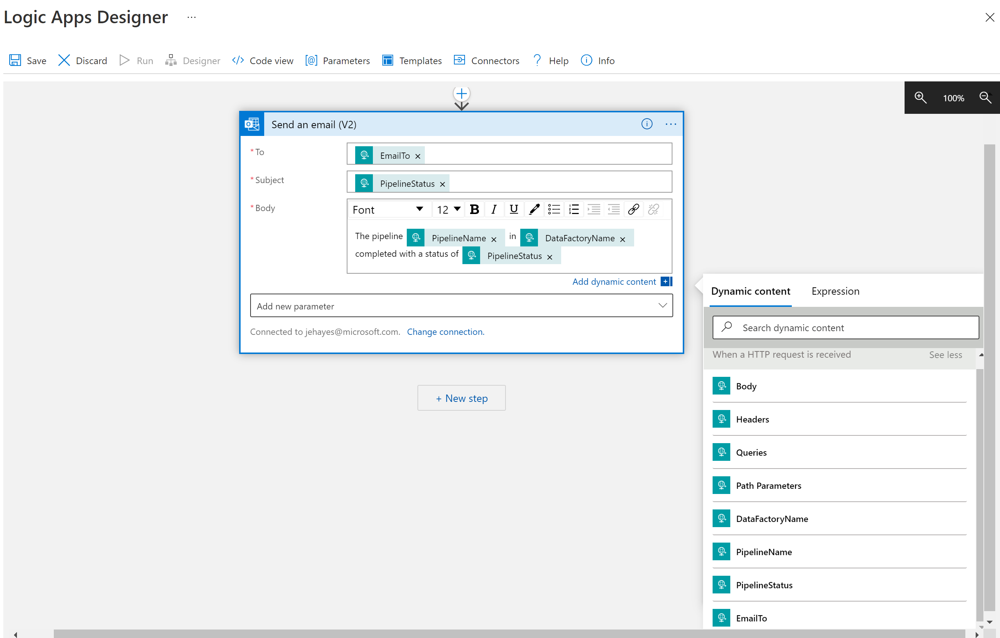
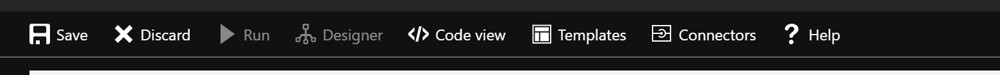
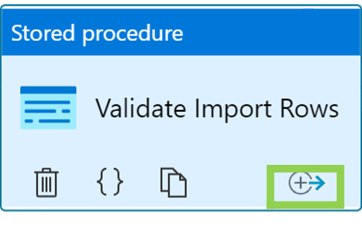
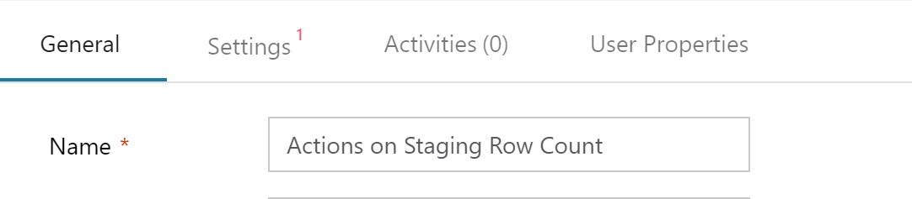

   
 

# Control Flow with Azure Data Factory
  

**Introduction**

During this lab, you will learn how to configure Control Flow within your Azure Data Factory pipelines.

**Estimated Time**

90 minutes

**Objectives**

At the end of this lab, you will be able to:

-   Configure a Data Transformation pipeline.

-   Use the Flow Control to add error handling and control the path of execution.

**Logon Information**

Use the following credentials to login into virtual environment:

-   Username: **Administrator**

-   Password: **Microsoft1**

# Table of Contents

[Lab: Control Flow with Azure Data Factory 3](#lab-control-flow-with-azure-data-factory)

[Exercise 1: Prepare your environment 3](#section)

[Exercise 2: Implement Control Flow 5](#exercise-2-implement-control-flow)

[Exercise 3: Extend the Control Flow with Lookup and IF Condition activities 23](#exercise-3-extend-the-control-flow-with-lookup-and-if-condition-activities)

## Lab: Control Flow with Azure Data Factory

During this lab, you will learn how to do data transformations with Azure Data Factory.

### 

### Exercise 1: Prepare your environment

This step will take you through preparing your environment for the exercises which will follow.

#### Tasks

1.  Connect to the Microsoft Azure Portal

    Open Internet Explorer and navigate to [**http://portal.azure.com/**](http://portal.azure.com/) to connect to Microsoft Azure Portal. Sign in with your subscriptions credentials.

2.  Create database objects

<!-- -->

1.  Using either SSMS, Azure Data Studio or the Azure Portal connect to your **Azure SQL Database.** To get your SQL Server name, navigate to SQL Servers in the Azure Portal, click on your SQL Server, click on the **Properties** section under **Settings** and copy your Server name.

2.  Run the following scripts, in order, against the database to create the required database objects.

    \\LabFiles\\M03\_L02\_Lab1\\SalesLT\_ProductStaging.sql  
    \\LabFiles\\M03\_L02\_Lab1\\SalesLT\_usp\_CheckProductStaging.sql  
    \\LabFiles\\M03\_L02\_Lab1\\SalesLT\_usp\_GetRowCountProductStaging.sql  
    \\LabFiles\\M03\_L02\_Lab1\\SalesLT\_usp\_PrepareProductStaging.sql  
    \\LabFiles\\M03\_L02\_Lab1\\SalesLT\_usp\_TruncateProductStaging.sql

Exercise 1 has been completed.

### Exercise 2: Implement Control Flow

This exercise shows the benefits of using Control Flow within your pipeline.

#### Tasks

1.  Connect to Microsoft Azure Portal

    Open Internet Explorer and navigate to [**http://portal.azure.com/**](http://portal.azure.com/) to connect to Microsoft Azure Portal. Sign in with your subscriptions credentials.

2.  Prepare the Azure Blob Storage

<!-- -->

1.  Using Azure Storage Explorer or the Azure Portal connect to the storage account created by the ARM Template in M02\_L01\_Lab01.

2.  Create a blob container called **m03-l02-lab01** in the root of the storage account.

<!-- -->

3.  Upload the input file

<!-- -->

1.  A sample file to use as the input has been provided for you in the lab files **\\M03\_L02\_Lab01\\products.csv**.

2.  Using Azure Storage Explorer (or the Azure Portal) to upload this file to the **/m03-l02-lab01/csv** container and folder.  
        

<!-- -->

4.  Log onto your Azure Data Factory

<!-- -->

1.  In the Azure portal, navigate to the ADF instance you previously provisioned and then launch the Azure Data Factory UI by selecting Open in the ADF blade

       

<!-- -->

5.  Verify that you have configured the Linked Service to the Azure Blob Storage account created in a previous lab. If so, go to step 6; otherwise, continue with the instructions below:

<!-- -->

1.  If you do not have a Linked Service already in your Data Factory to your Blob Storage account, follow the steps below to create one:

    1.  Select the **Toolbox/Manage** button from the left panel.

    2.  Select **Linked Service** and then select **+New**.

          

    3.  Select the **Azure Blob Storage** type and click the **Continue** button.  
            

    4.  Change the **Linked Service name** if desired (for example: use the storage account name).

    5.  Select your **Subscription** then your **Azure Storage Account** from the dropdown and click the **Create** button.

>     

6.  Configure the Azure SQL Database Linked Service in ADF

<!-- -->

1.  From the Toolbox/Manage button from the left panel, under **Linked services**, select **+New**.

      

2.  On the Data Store tab, select **Azure SQL Database** and click the **Continue** button.

    

3.  Enter a name for the linked service. Something descriptive (for example: **AzureSQL\_&lt;DBName&gt;**)

4.  Select **AutoResolveIntegrationRuntime**.

5.  Select the **Subscription**, **Azure SQL Database server** and **database.**

6.  Select **SQL authentication** for **Authentication** **Type**.

7.  Enter the **User name** and **Password** use specified during lab module M01\_L02\_Lab01(Create and monitor Azure Data Factory using ARM).

8.  Select **Test Connection** and make sure the connection succeeds.

9.  Then select **Create**.

<!-- -->

7.  Create a Dataset – Azure Blob Storage

<!-- -->

1.  We will need a dataset that points to the file uploaded earlier in this exercise.

<!-- -->

10. Click on the **Author/Pencil** button in the left pane.

       

11. Create a new dataset by clicking the **+** button and selecting **Dataset**

       

12. Select **Azure Blob Storage** and then **Continue**.

13. Select **DelimitedText** and then **Continue**.

14. Provide a name for the dataset, such as **ProductsCSV,** and select the **Linked Service** created for Blob Storage in an earlier exercise.

15. **Browse** to the csv file uploaded (m03-l02-lab01/csv/Products.csv) and check the box for **First row as header**.

16. Click the **OK** button.

    

8.  Create a Dataset – Azure SQL Database

<!-- -->

1.  We will need a dataset that points to the Azure SQL Database so that we can use it within our activities.

2.  Create a new dataset by clicking the **+** button and selecting **Dataset**.

3.  Select the **Azure SQL Database** and then **Continue**.

4.  On the Set Properties tab, change the dataset Name to **ProductStaging**.

5.  Select the **Linked Service** you created earlier in this exercise, and the table **\[SalesLT\].\[ProductStaging\]**.

>     

17. Select **OK** to save the dataset.

<!-- -->

9.  Create a Pipeline and data gestation

<!-- -->

1.  Create a new pipeline by clicking the **+** button and selecting **Pipeline**.

2.  Under **Activities**, expand the **Move** **&** **transform** and drag the **Copy Data** activity to the designer surface.

>     

18. In the Copy Data General tab, set the Name to **Import CSV**.

19. Switch to the **Source** tab. Select the **ProductsCSV** dataset.

      

20. Switch to the **Sink** tab. Select the **ProductsStaging** Linked Service for the destination we will copy to. Set the Storage Procedure Name to **None**.

    

21. Switch to the **Mapping** tab. Choose **Import Schemas.** Remove the **row for the StagingID column** by clicking the check box to the left and click **Delete**.

>     

22. If you have Git configured, click the **Save all** button to save your changes.

23. Click the **Publish** button to save the changes to the Pipeline before proceeding.

<!-- -->

10. Add Data validation activity

<!-- -->

1.  From the list of **General** **Activities**, add a **Stored Procedure** activity to the designer surface of the Pipeline you are working on.

    

24. Change the name of the activity to **Validate Import Rows**.

25. Switch to the **Settings** tab and select your SQL Linked Service **\[SalesLT\].\[usp\_CheckProductStaging\]** from the drop-down list.

      

26. Select **Save a**ll (if Git configured) then **Publish** on the Pipeline to deploy changes.

<!-- -->

11. Add Logic Apps for sending email notifications

<!-- -->

1.  In the Azure Portal, enter **Logic** **app** in the search bar, then click Add or **Create**

      

<!-- -->

27. Select the **Resource** **Group** you have been using for the workshop.

28. Change type to Consumption

29. Give the Logical app a suitable **name** (i.e. &lt;initials&gt;-la-pipeline-status).

30. Choose East US Region

31. Check no for Enable log analytics

     

32. Click **Review and Create**, then **Create**.

33. After it has deployed, click on **Go to resource**.

34. In the Logic App Designer, select the Http Trigger (**When** **a HTTP request is received**).

35. Add the text from the **\\LabFiles\\M03-L02-Lab01\\HTTPRequestBodyJSON.txt** file to the **Request Body JSON Schema** section

    {

    "properties": {

    "DataFactoryName": {

    "type": "string"

    },

    "PipelineName": {

    "type": "string"

    },

    "ErrorMessage": {

    "type": "string"

    },

    "PipelineStatus": {

    "type": "string"

    },

    "EmailTo": {

    "type": "string"

    }

    },

    "type": "object"

    }

    }     

36. Select the **+New Step** use the search bar to find and select **Outlook.com – Send an email**. (Note this is the provider for your email account. You can use other mail provider activities such as Office 365.com, Gmail, etc. but these may have slight variations in sign-in/authentication processes and configuration) Also, your browser cannot be in Incognito and/or InPrivate mode when signing in.

37. **Best option : Sign In** and use your corporate email. **Additional Option**: You may be able to use a personal email, such as the email you registered for the class with or a gmail account.

    

38. Enter the details of the email. You can either hard code the fields, or to make this more scalable use a combination of text and the dynamic fields selector as shown below. When you click into a field, a fly out box will appear with the available Dynamic content and Expression builder.  
        

    Hint: if you do not see the json parameters when your cursor is in any of the Email required fields, click on the **See more** hyperlink in the Dynamic content section.

      

39. **Save** when ready.  
        

40. Expand the **HTTP request** trigger and copy the **HTTP Post URL** for later reference (into Notepad or similar).  
        

      

<!-- -->

12. Configure the Pipeline Parameters

<!-- -->

1.  In your Data Factory, click on the whitespace of the designer surface.

<!-- -->

41. Edit the parameters of the pipeline and add **EmailTo** of type **String** and the value of your email address.  
        

<!-- -->

13. Add Web Activity to send failure notification

<!-- -->

1.  Add a **Web** Activity to the pipeline.  
        

<!-- -->

42. Set the name of the Web Activity to **Send Failure Notification**.

43. On the Settings tab, enter the **URL** from the HTTP trigger of the relevant Logic App you created (previously copied in step **12.l**)

44. Set the **Method** to **POST**.

45. Click **+New** next to **Headers**.

46. In this Header section, enter **Content-Type** for name and **application/json** for value.

47. In the Body field add the contents of the file **\\M03-L02-Lab1\\WebActivityBodyFailure.txt**.

    {

    "DataFactoryName":

    "@{pipeline().DataFactory}",

    "PipelineName":

    "@{pipeline().Pipeline}",

    "PipelineStatus":

    "@{activity('Validate Import Rows').error.message}",

    "EmailTo":

    "@{pipeline().parameters.EmailTo}"

    }

<!-- -->

14. Copy the Web Activity to send a success notification

    1.  Right click on your Send Failure Notification Web activity and select **Copy**

          

    2.  Right click on the whitespace of the pipeline canvas and choose **Paste**

          

    3.  Rename your new Web activity to Send Success Notification

<!-- -->

48. Go to the Settings tab and delete the code in the Body field. Replace the contents of the boody field with add the contents of the file **\\M03-L02-Lab1\\WebActivityBodySuccess.txt**.

    {

    "DataFactoryName":

    "@{pipeline().DataFactory}",

    "PipelineName":

    "@{pipeline().Pipeline}",

    "PipelineStatus":

    "Completed Successfully",

    "EmailTo":

    "@{pipeline().parameters.EmailTo}"

    }

<!-- -->

15. Configure the Flow Control

<!-- -->

1.  The Pipeline should have 4 activities  
        

<!-- -->

49. Select the green box next to **Import CSV** and drag it to the **Validate Import Rows** activity. This will create a success path between the two activities.  
        

50. Select the green box next to **Validate Import Rows** and drag it to the **Send Success** activity.

51. Select the **Validate Import Rows** activity and notice the Add output icon in the lower right corner of the activity.

      

52. Click on the Add output icon and choose **Failure**.

      

53. The pipeline will look like this:  
        

54. If you have connected your Data Factory to a Git repository, click **Save**.

<!-- -->

16. Execute the pipeline

<!-- -->

1.  We are now ready to execute the pipeline. The stored procedure used in the validation phase is designed to error when there are no rows imported, as you might do in a real-world case. But it is also configured to error when there are more than 300 rows in the table, which in our case indicates that the table was not truncated before the import (we haven’t implemented that step).

<!-- -->

55. First, use the **Publish** button in the toolbar to ensure the changes are pushed to the ADF service.  
        

56. Make sure the publish process completes before proceeding.

57. Click either the Debug or Trigger method to execute the pipeline.  
        

58. If using the Debug method, you should see indications in the designer as it progresses through the execution. If you used the Trigger method, then switch to the Monitoring tab and view the execution process and outcome.

59. When complete you will be able to see (in the run tasks) which pathway was taken. If using Debug method, you can also see the pathway through the icons on the designer. You should also receive an email.  
        

60. Execute the pipeline again. This time it should follow the Failure path due to the conditions in our validation stored procedure. You should also receive an email message reporting the failure.

61.     

Exercise 2 has been completed.

### Exercise 3: Extend the Control Flow with Lookup and IF Condition activities

This exercise shows how to extend the existing pipeline with additional Flow Control using both activity output and specifically designed activities. In this scenario we need to add additional logic to check if the staging table contains data and then perform a truncation before continuing.

#### Tasks

1.  Rename the existing pipeline

<!-- -->

1.  We will use the existing pipeline as a child to avoid duplicating activities. Edit the existing pipeline you created in the previous exercise. On the Properties panel to the right, rename the pipeline to **pipeline\_ImportData**.  
        

<!-- -->

62. If you have Git enabled, select **Save** in the pipeline toolbar. Otherwise, click **Publish**.

<!-- -->

2.  Create a new pipeline

<!-- -->

1.  Create a new pipeline by clicking the + button under Factory Resources and selecting Pipeline.

2.  Rename the pipeline to **pipeline\_ImportData\_Control**.  
        

<!-- -->

63. If you have Git enabled, select **Save** in the pipeline toolbar.

<!-- -->

3.  Add a Lookup activity to the pipeline

<!-- -->

64. Locate the **Lookup** activity in the General section and drag it onto the designer surface.  
        

65. Change the name of the activity to **Lookup Staging Row Count**.  
        

66. Switch to the **Settings** tab. Select the **Source Dataset** as ProductsStaging (the Azure SQL Database dataset configured earlier).

67. Set the Use Query to **Stored Procedure** and select the **\[SalesLT\].\[usp\_GetRowCountProductStaging\]** stored procedure from the drop-down.

68. Take note there is a **First Row Only** check box at the bottom of settings. In this case leaving that checked is ok. Be sure to review the documentation regarding the changes to behavior with that setting and a dataset.

69. Select **Save** in the pipeline toolbar if you have Git enabled.

<!-- -->

4.  Add an IF Condition activity to the pipeline

<!-- -->

1.  Locate the **IF Connection** activity in the Iteration & Conditions section and drag it onto the designer surface.  
        

<!-- -->

70. Change the name of the activity to **Actions on Staging Row Count**.  
        

71. Create an Activity Output Condition between the **Lookup Staging Row Count** and the **Actions on Staging Row Count** for **Success**.  
        

72. Switch to the **Activities** tab of the **Actions on Staging Row Count** activity. Place the cursor in the Expression field, then select the **Add dynamic content** link or press **Alt+P**.

73. Enter the following into the Expression field. This will use the value from the lookup activity as part of an evaluation which returns true/false.

    **@equals(activity('Lookup Staging Row Count').output.firstRow.RowCount, 0)  
    **  
        

For more on Logical Functions see <https://docs.microsoft.com/en-us/azure/data-factory/control-flow-expression-language-functions>

74. Click **Finish** to add the Dynamic content to the Expression field.

75. Click on the Pencil for to the Case = True.

      

76. This will open a new child designer surface. Notice the context path within the pipeline above the designer surface.  
        

77. Here we will use the existing pipeline to avoid duplicating activities.  
    Locate the **Execute Pipeline** activity in the **General** section. Drag it onto the designer surface.  
        

78. Rename the activity to **Import Data on True**.

79. Switch to the **Settings** tab, select **pipeline\_ImportData** from the Invoked pipeline drop down.  
        

80. Notice that the **Parameters** from the Import Data pipeline are carried over. The value could be defined by a parameter on the control pipeline, or even a looked-up value from a database table or config file. In a real-world solution you would most likely configure those settings. To keep it simple for this exercise just use the default value you have already configured (for example: hard coded configuration).  
        

81. Click **Save** if you have Git configured.

82. Navigate back to the main designer surface of the pipeline using the contextual path at the top of the designer surface. In other words, click on the **pipeline\_ImportData\_Control** hyperlink.

      

83. Click on the Pencil for to the Case = False. Again, this opens a child designer surface.

84. Here we will again call the **pipeline\_ImportData** pipeline. Add an Execute Pipeline activity to this designer surface as you previously did. Since activity names must be unique within a pipeline, use the name **Import Data on False**.

85. Based on the business requirements we need to truncate the table before importing if it already has data.  
    Locate the Stored Procedure activity in the **General** section and drag it onto the designer surface.  
        

86. Change the name of the activity to **Truncate Staging Table**.

87. Switch to the **Settings** tab and select your Azure SQL Linked Service. Then select **\[SalesLT\].\[usp\_TruncateProductStaging\]** from the drop-down list.

88. Add an **Activity Output Condition** between this Stored Procedure Activity and the Execute Pipeline activity **on Success**.  
        

89. Navigate back to the main designer surface of the pipeline using the contextual path at the top of the designer surface.

90. Select **Save** on the Pipeline to save changes, if using Git.

91. Click **Publish** to deploy your changes to the Data Factory service.

<!-- -->

5.  Execute the Pipeline

<!-- -->

1.  Using the same methods as in the earlier exercise execute the pipeline **pipeline\_ImportData\_Control** and observe the paths used. In the following screenshot the execution has followed the False conditional path.  
      
      

<!-- -->

92. You could try truncating the table manually and then executing again to force the activity to follow the true path.

Exercise 3 has been completed.
