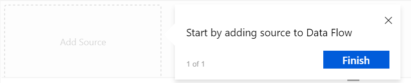
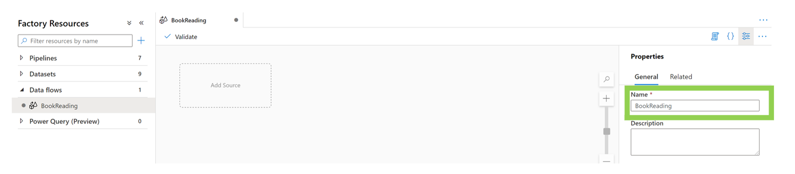
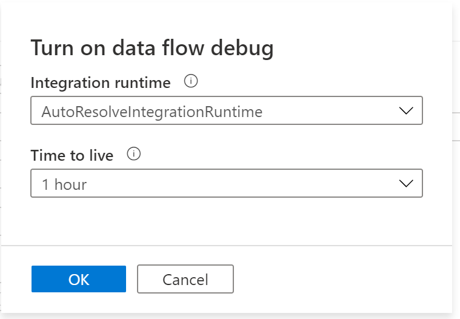
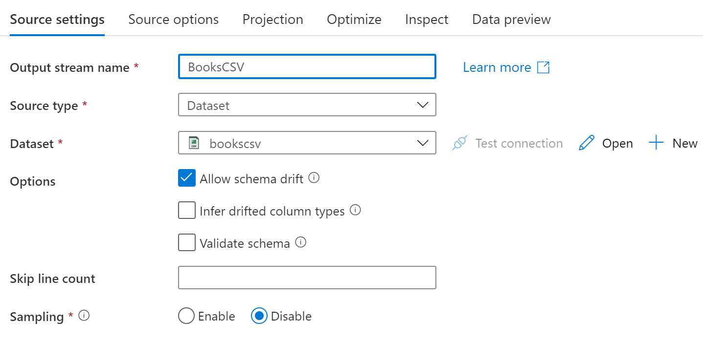
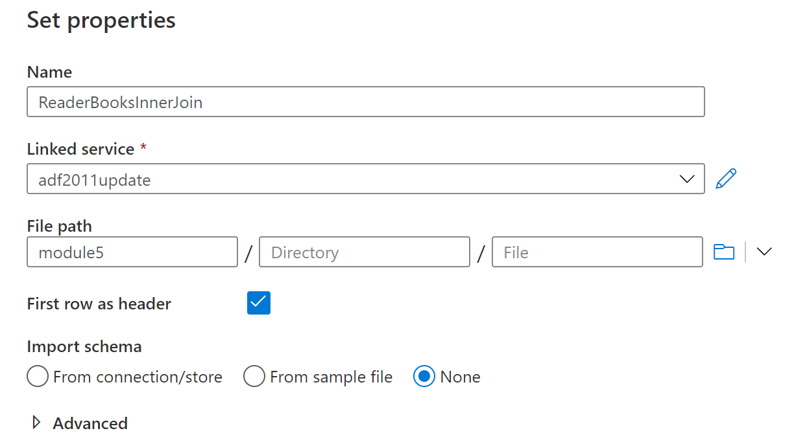
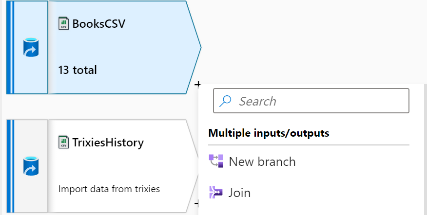
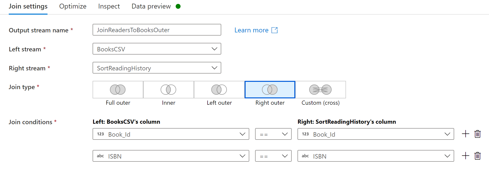

   

# Data Flow in Azure Data Factory

**Introduction**

During this lab, you will create a Data Flow task in Azure Data Factory, joining different data sources together.

**Estimated Time**

90 minutes

**Objectives**

At the end of this lab, you will be able to:

-   Configure a Data Flow pipeline.

-   Use debugging in Data Flow.

-   Execute a Data Flow pipeline from an ADF Pipeline.

**Logon Information**

Use the following credentials to login into virtual environment.

-   Username: **Administrator**

-   Password: **Microsoft1**

# Table of Contents

[Lab: Transform, Merge and Join Data in Mapping Data Flow 3](#lab-transform-merge-and-join-data-in-mapping-data-flow)

[Setup: Prepare your environment 3](#setup-prepare-your-environment)

[Exercise 1: Implement Control Flow 4](#exercise-1-implement-control-flow)

## Lab: Transform, Merge and Join Data in Mapping Data Flow

During this lab, you will learn how to do data transformations with Azure Data Factory Data Flow by looking at the reading history of 4 people, Keiko Brooks, Minerva Snape, Sven Dorjadt and Trixie Belden. In addition to the books these people have read, there is a file which contains information about a number of books, many (but not all) of which have been read by our readers.

We are going to learn how to join the reading history files (some of which have different columns) to each other, as well as to the list of books.

### Setup: Prepare your environment

This step will take you through preparing your environment for the exercises which will follow.

#### Tasks

1.  Connect to the Virtual Machine

    Under the Commands menu, select **Ctrl+Alt+Delete**. Then from the Commands menu again select Paste, then Paste Password. Then press Enter to sign into the machine.

2.  Connect to Microsoft Azure Portal

    Open Internet Explorer and navigate to <http://portal.azure.com/> to connect to Microsoft Azure Portal. Login with your subscriptions credential.

3.  Create source files in new Container

<!-- -->

1.  Navigate to the storage account you have been using for this workshop, and create a new container named **module5**.

<!-- -->

1.  In this container, using Storage Explorer, upload the following files from LabFiles\\M05\_L01\_Lab01 to a folder named **originals**:

-   Books.csv

-   Keikos\_History.csv

-   Minervas\_History.csv

-   Svens\_History.csv

-   Trixies\_History.csv

### Exercise 1: Implement Control Flow

This exercise shows the benefits of using Control Flow within your pipeline.

#### Tasks

1.  Log onto your Azure Data Factory

<!-- -->

1.  Log into the Azure Data Factory you created earlier in this workshop.

2.  Select the **Open Azure Data Factory Studio** tile to start the Azure Data Factory user interface (UI) application.

    
 
2.  Configure the Azure Storage Linked Service in ADF

<!-- -->

2.  Verify that you have configured the **Linked Service** to the **Azure Blob Storage account**. You may have an existing connection from previous lessons. If you do, skip to step 3.

3.  Click the **Toolbox/Manage** button on the left panel.

       

4.  Under **Connections** in left panel, click on **Linked services**, if not already selected, and then click on **+New** in the middle pane.     
      
      
5.  Select the **Azure Blob Storage** type and click the **Continue** button.  
        

6.  Change the Linked Service name if desired (for example: use the storage account name).

7.  Select the **Azure subscription** from the drop-down.

8.  Select the **Storage account** **name** from the drop-down and click on **Test** **Connection** test the connection.

9.  Once successfully tested, select **Create**.

10.    

<!-- -->

3.  Create Datasets – Azure Blob Storage

    Create datasets which reference the files uploaded to Azure Storage earlier in this lab.

<!-- -->

1.  Click on the **Pencil/Edit** in the left pane.

       

<!-- -->

11. Create a new dataset by clicking the **+** button under **Factory** **Resources** and selecting **Dataset**.

       

12. Select **Azure Blob Storage** and click the **Continue** button.

    

13. Select **DelimitedText** and click the **Continue** button.

    

14. Enter **bookscsv** for the Name and select the **Linked** **Service** created for Blob Storage earlier in this exercise.

15. Click on the **Folder** button to the right of the **File path** boxes.

       

16. Drill down to the books.csv file uploaded earlier in the exercise by double clicking on the module5 container, double clicking the originals folder, and selecting the books.csv file. Click **OK**.

       

17. Checkmark the box for **First row as header**. Click the **OK** button.

    

18. Repeat steps 3b through 3h to create Datasets for the other files in your module5/originals folder in your Storage account. When you are done, you should have added 5 Datasets to your Data Factory.

       

19. Now is a good time to save/publish your work.

<!-- -->

4.  Create a Data Flow Pipeline

<!-- -->

1.  Create a new data flow by clicking the **+** button, hovering over **Data Flow** and selecting **Data Flow** from subsequent list.

    

20. In the new tab, a pop-up window may show with the text **Start by adding source to Data Flow**. If so, click the **Finish** button.

    1.  Similar popups will show while using Data Flow to help. Read these, including all pages if desired, and click the **Finish** button once read.

    

In the Data Flow Properties pane to the right, enter **BookReading** for the Name.

   

5.  Enable Data flow debug

    Data flow debug allows you to preview your data while developing your Data flow. When enabled, it will start a cluster on an Azure Integration Runtime, which takes approximately 6 minutes to start up.

<!-- -->

2.  Click on the Data flow debug slider in the ribbon.

       

3.  When prompted for **Turn on data flow debug**, click **OK**.

       

<!-- -->

6.  Add source data to the Data Flow

<!-- -->

1.  Select the **Add Source** rectangle in the center pane

       

2.  Click on the Dataset dropdown box and select the **bookscsv** **dataset** created in Step 3 for the books.csv file. Enter **BooksCSV** for the Output stream name.

>     
   

21. Select the **Projection** tab and set the following columns to integer type, with a format of \#\#0:

-   Book\_ID

-   Number\_of\_Pages

-   Year\_Published

-   Original\_Publication\_Year

22. Set the following columns to float, and type 0.00 in the format box. (0.00 is not shown as an option in the dropdown list. You can manually enter your own format strings).

    Average\_Rating

23. Leave the remaining columns as string.

>     

24. Select the **Data Preview** tab and click **Refresh** to preview the data. (If your Debug cluster is still starting, you will see a “Please wait..” message. Click **Refresh** to display the data after the cluster has started.)

25. Select the **Add Source** area under the last source you created.

    

26. Under Source Settings, name the **Output Stream** TrixiesHistory and select the **dataset Trixies\_History** created earlier in this lab.

27. Select the Projection tab and set the following columns to integer type, with a format of \#\#0:

-   Book\_ID

-   My\_Rating

-   Read\_Count

28. Set the following columns to **date**, and set the format to **dd/MM/yyyy** (this is a result of the format of the dates in the files):

-   Date\_Read

-   Date\_Added

-   Original\_Purchase\_Date

29. Set the following columns to boolean:

    Spoiler

30. Leave the remaining columns as string.

    

31. Go to the **Data Preview** tab and click Refresh to preview the data.

32. Repeat steps 6g through 6m for the other svens, minervas and keikos reader history files, changing names as appropriate.

33. You should now have 5 data sources on your canvas.

       

<!-- -->

7.  Prepare reading history data to be joined

    The intent is to join the four reading history files together, along with the books.csv file, to output the data in a single file.

    The four readers are not identified in their files, so we need to create a column to identify them.

<!-- -->

1.  Click the **+** plus sign next to TrixiesHistory on the pipeline canvas.

    

34. From the popup list, select **Derived Column**.

35. Name the output stream **AddReaderNameT**.

36. For Columns type, enter the column name **Reader** and for the expression enter **Trixie Belden**, enclosed in single quotes.

    

37. Repeat step 7a through 7d to create a Derived Column called Reader for the other Reader History data sources, entering their full names as shown below:

| Source  | Output stream Name | Reader column Expression |
|---------|--------------------|--------------------------|
| Minerva | AddReaderNameM     | Minerva Snape            |
| Sven    | AddReaderNameS     | Sven Dorjadt             |
| Keiko   | AddReaderNameK     | Keiko Brooks             |

8.  Join all the reader history data into a single stream

<!-- -->

1.  Select the **+ plus** sign next to **AddReaderNameT** and select **Union**.

     

38. Name the output stream **AllReaders**. In the **Union with** field select **AddReaderNameK**. Click the plus sign and add rows for **AddReaderNameS** and **AddReaderNameM**, so all readers have their reading history in one stream.

     

39. Under the Inspect tab, you can see how the columns have been aligned for the join, including the blanks from the columns missing from the files for KeikosHistory and MinervasHistory. Also note that the out of order columns are now aligned.

<!-- -->

9.  Inspect the data to be sure all 4 datasets have been joined.

<!-- -->

40. Select the **Plus + sign** next to AllReaders and select **Sort** under the **Row** **modifier** heading from the popup list of transformations.

       

41. Name the output stream **SortReadingHistory**. In **Sort conditions** and select the column **Book\_Id** and **Order** ascending.

       

    (This isn’t strictly necessary but provides an easy way within the debug mode to show that data is flowing in from different source files, given our data set.)

42. Go to the **Data Preview** tab to review the data, and you should be able to find records from all 4 of our readers.

<!-- -->

10. Join the reader and book data together.

<!-- -->

43. Select the **Plus + sign** next to the **SortReadingHistory** Output stream and select **Join**.

   

44. Name the output stream **JoinReaderstoBooks** and select **BooksCSV** from the **Right stream** dropdown.

45. Set the Join type to **Inner** and add 2 columns to the Join conditions: **Book\_Id** and **ISBN**.

     

46. Go to the **Data Preview** tab which now shows duplicate columns in the dataset, Book\_Id, ISBN and ISBN13. We should remove them to avoid any confusion for the users of our data.

<!-- -->

11. Remove resulting duplicate columns

<!-- -->

1.  Select the **Plus + sign** next to the **JoinReaderstoBooks** output stream and choose the **Select** transformation under the **Schema Modifier** heading.

2.  Name the Output stream **RemoveDuplicateColumns.** Scroll down through the Input column list until you see the duplicate column names from the BooksCSV output stream. Remove these duplicated columns (BooksCSV@Book\_Id, BooksCSV@ISBN and BooksCSV ISBN13) from the input columns by clicking on the delete buttons at the end of each row.

       

<!-- -->

12. Output the joined books and reader data

<!-- -->

1.  Select the **Plus + sign** next to the **RemoveDuplicateColumns** Output stream, select the **Sink** transformation under the **Destination** heading and name it **ReadersBooksInnerJoin**.

<!-- -->

47. Select **+New** next to the **Dataset** field to create a new dataset.

48. Choose **Azure Blob Storage** for the data store type.

49. Select **DelimitedText** for the format. Click **Continue**.

50. Enter **ReadersBooksInnerJoin**, for the name.

51. Select the same Linked service used throughout this lab. Browse to your container name or manually enter module5 as the container name. (If you named your container something else, use this name instead.)

52. Check **First row as header** box

53. Select **None** for **Import** **Schema**

54. Select **OK**.

     

55. Click on the **Settings** next to Sink, select **Output to single file** and enter the filename of **InnerJoinDataset.csv**. Note the warning about writing large datasets to a single file. This is not a concern with our dataset.

       

56. On **Optimize** tab, set partition option to be **Single partition**.

     

13. Second join of the books and reader data

<!-- -->

57. Select the **Plus + sign** next to the **BooksCSV** Source and select **Join**.

       

58. Name this output stream **JoinReadersToBooksOuter**.

59. Select **SortReaderHistory** as the **Right stream** and Right outer as the **Join Type** and add 2 columns to the Join conditions: **Book\_Id** and **ISBN**.

       

    This output stream will include all reader history records even if there is no matching record in the BooksCSV source.

<!-- -->

14. Second removal of duplicate columns

<!-- -->

1.  Select the **Plus + sign** next to the **JoinReadersToBooksOuter** Output stream and choose **Select**.

<!-- -->

60. Name this Output stream **RemoveDuplicateColumns**, and observe the error from Data Flow, which does not allow multiple transformations to have the same names. Add a **2** to the end of the name.

61. Again, remove the duplicated columns (Book\_Id, ISBN and ISBN13) from the Books file.

<!-- -->

15. Second output of data

<!-- -->

1.  Select the **Plus + sign** next to the **RemoveDuplicateColumns** Output stream and choose **Sink.**

2.  Name this Output stream **ReadersBooksOuterJoin.**

3.  Select **+New** next to the **Dataset** field to create a new dataset.

4.  Choose **Azure Blob Storage** for the data store type.

5.  Select **DelimitedText** for the format. Click **Continue**.

6.  Enter **ReadersBooksOuterJoin**, for the name.

7.  Select the same Linked service used throughout this lab. Browse to your container name or manually enter module5 as the container name. (If you named your container something else, use this name instead.)

8.  Check **First row as header** box

9.  Select **None** for **Import** **Schema**

10. Select **OK**.

11. Click on the **Settings** next to Sink, select **Output to single file** and enter the filename of **ReadersBooksOuterJoin.csv**. and select **Output to single file** name.

12. Make sure to select **Single partition** on the **Optimize** tab.

<!-- -->

62. Your Data Flow should look similar to the screenshot below.

     

16. Save and Publish the Data Flow

<!-- -->

1.  Select **Publish All** to save the flow and all related datasets.

    If any validation errors occur, review and fix each message.    

<!-- -->

63. Once the publishing has completed and there are no validation errors, continue to the next step.

<!-- -->

17. Create a Pipeline to run the Data Flow

<!-- -->

1.  Select the **Plus Sign +** next to the Filter resources by name box and select **Pipeline** to create a new pipeline.

    

64. Rename the pipeline **plRunBookReadingDataflow**

       

65. Expand **Move & Transform** and drag the **Data Flow** activity onto the canvas.

    

66. Under General, name the activity **Run BookReading Flow**.

       

67. Click on the **Settings** tab. Select the **BookReading** data flow from the Data flow drop down. Leave the Integration Runtime default values.

       

68. Select **Publish all**.

<!-- -->

18. Run the Pipeline and Data Flow

<!-- -->

1.  Once publishing has completed successfully, choose **Trigger,** select **Trigger now** and press **Ok**.

<!-- -->

19. Monitor the run

<!-- -->

1.  Select Monitor on the left side of the portal, and see the pipeline running. Click on the **Pipeline name**.

     

69. Select the glasses icon to see the **details** of the activity.

    

70. The screenshot below shows the transformation activities being run. The screen will refresh every 60 seconds until the run is complete if Auto refresh is on (as shown below.) Note the time AcquiringCompute in the upper right corner – this will take approximately 6 minutes.

     

71. After the Data flow is complete, you can see the statistics for the time and number of rows processed. Compare the outputs from the two csv files, ReadBooksInnerJoin and ReadBooksOuterJoin . Why were there differences in the rows returned in each of the csv files?

       

Exercise 5 has been completed.
