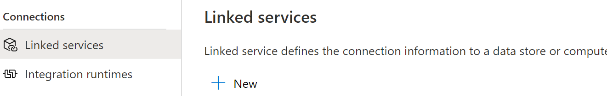

    

# Azure Data Factory v2 Security 

**Introduction**

During this lab, you will learn how to store and retrieve credentials used by Azure Data Factory linked services in Azure Key Vault, improving the security of your environment.

**Estimated Time**

20 minutes

**Objectives**

At the end of this lab, you will be able to:

-   Configure Data Factory to communicate with Azure Key Vault.

-   Retrieve secrets from Azure Key Vault in Azure Data Factory.

**Logon Information**

Use the following credentials to sign into virtual environment.

-   Username: **Administrator**

-   Password: **Microsoft1**

# Table of Contents

[Lab: Azure Data Factory Security 3](#lab-azure-data-factory-security)

[Exercise 1: Retrieve the Data Factory Service Identity 3](#exercise-1-retrieve-the-data-factory-service-identity)

[Exercise 2: Store and Retrieve secrets in Azure Key Vault 6](#exercise-2-store-and-retrieve-secrets-in-azure-key-vault)

## Lab: Azure Data Factory Security

During this lab, you will learn how to securely store secrets in Azure Key Vault for use with Azure Data Factory.

### Exercise 1: Retrieve the Data Factory Service Identity

This exercise shows how to retrieve the Azure Data Factory Service Identity.

#### Tasks

1.  Connect to the Virtual Machine

    Under the Commands menu, select **Ctrl+Alt+Delete**. Then from the Commands menu again select Paste, then Paste Password. Then press Enter to sign into the machine.

2.  Connect to Microsoft Azure Portal

    Open Internet Explorer and navigate to [**http://portal.azure.com/**](http://portal.azure.com/) to connect to the Microsoft Azure Portal. Sign in with your subscription’s credentials.

3.  Create Managed Identity using PowerShell

    A Managed Identity is automatically created when you create the Data Factory in the Azure Portal or with PowerShell. If you create the Data Factory from an ARM template (like we did in a previous lab), you will need to run a PowerShell command which will create the Managed Identity in the existing Data Factory.

<!-- -->

1.  Open the Cloud Shell from the Azure Portal.

    

1.  Modify and run the following command:

    Set-AzDataFactoryV2 -ResourceGroupName *&lt;resource group name&gt;* -Name *&lt;ADF name&gt;* -Location *&lt;ADF location&gt;*

2.  You may get a warning that says the Data Factory already exists. If you do, just select Y since this will just create the Managed Identity for the Data Factory. You will not lose your Data Factory assets (pipelines, linked services, etc. )

3.      

Exercise 1 has been completed.

### Exercise 2: Store and Retrieve secrets in Azure Key Vault

This exercise shows how to configure Azure Data Factory to securely store secrets in Azure Key Vault. To configure the trust between the two services you will need to have completed Exercise 1.

The method shown in this lab, using the SQL Database created in M01\_L01\_Lab01, can be used with many other services where connection strings and credentials are required, such as Azure Storage, CosmosDB.

#### Tasks

1.  Create an Azure Key Vault

<!-- -->

1.  Add a new Azure Key Vault to your Azure Subscription, alternatively you can use an existing Key Vault.

        
    

<!-- -->

4.  Once the Key Vault is provisioned, navigate to it in the Azure Portal and select Settings &gt; **Secrets**

5.  Select **+Generate/Import** to create a new secret.

        
    

6.  Ensure that Upload options is set to **Manual**.

7.  Give the secret a meaningful name (for example: WSPlusMod6SqlConnString). Use the following text as the **Value** after you modify the parameter values to reference your Azure SQL Server, Azure SQL Database, User ID and Password,

    **Server=tcp:&lt;*serverName*&gt;.database.windows.net; Database=&lt;*dbName*&gt;; User ID=&lt;*loginName*&gt;; Password=&lt;*password*&gt;; Trusted\_Connection=False; Encrypt=True;**

8.  Click the **Create** button.

    

<!-- -->

2.  Grant the Azure Data Factory access to Azure Key Vault

<!-- -->

1.  In the Azure Portal navigate to your Azure Key Vault resource. Select Access Policies &gt; +**Add Access Policy**.

    

<!-- -->

9.  Choose **Select principal**.

    

10. Enter the name of your Data Factory in the search box and click on your Data Factory. Then click **Select**.

    

11. Select **Get** and **List** from the Secret permissions drop-down.

    

12. Click the **Add** button.

13. Click **Save** to commit your changes.

    

    This grants the Data Factory permissions to read secrets from the Key Vault.

<!-- -->

3.  Create a Key Vault Linked Services pipeline

<!-- -->

1.  In your Data Factory portal, select the **Manage/Toolbox** link.

    

<!-- -->

14. Choose **+New** under the Linked Services tab.

    

15. Select the **Azure Key Vault** linked service type and **Continue**.

    

16. Give the linked service a suitable name and locate the Key Vault within your Azure subscription.

17. Select **Test Connection** and make sure the connection succeeds. If it doesn’t succeed then you need to check the Key Vault access policies for the Service Identity.

18. Click **Create**.

<!-- -->

4.  Reference secrets stored in key vault

<!-- -->

1.  We will use an Azure SQL Database to demonstrate this functionality. You should already have an Azure SQL Database from earlier labs and the pre-requisites, if not go to the Azure Portal and provision a database.

<!-- -->

19. From Linked services select **+New** and create a new connection to the **Azure SQL Database**.

    

20. Give the connection a meaningful name.

21. Change the selection from Connection String to **Azure Key Vault**.

    

22. Select the **AKV** linked service from the drop-down below.

23. Enter the name of the secret which you created earlier in this lesson (for example: WSPlusMod6SqlConnString).

24. Optionally enter the version you wish to use; best practice is to leave blank, which uses the latest version. This allows Data Factory to always use the most recent version of the secret without any changes needing to be made.

    

25. Select **Test connection** next to the Cancel button above and make sure that the connection succeeds. It may take a little longer to connect as the connection string needs to be retrieved from the Key Vault.

26. Then click on the **Create** button.

Congratulations you have now configured Data Factory to retrieve secrets from Key Vault. From here you could configure a Dataset and Pipeline to use the connection. With the test connection success, we have demonstrated the configuration to satisfy the purpose of this lab.

Exercise 2 has been completed.
